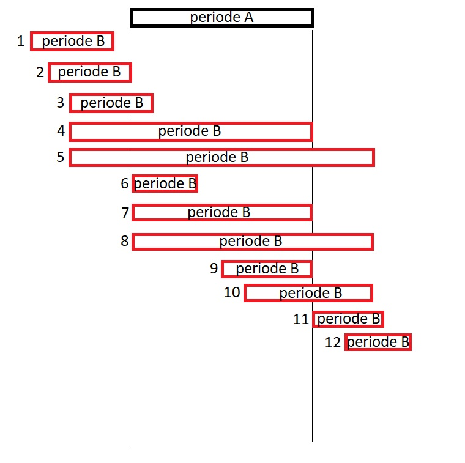

# Dokumentasjon PeriodeGenerator
Oppdraget som kommer inn via Simulering WS inneholder oppdragslinjer av typen OPPH eller YTEL.
Først leses alle disse oppdragslinjene gjennom og fordeler OPPH og YTEL linjer på hver sin liste
(opphørsPerioder og ytelsesPerioder). Deretter sorteres listene for sikkerhetsskyld etter fom-dato.

Det sjekkes om oppdragene kun inneholder opphør eller kun ytelse og returnerer fullstendig utbetaling
eller fullstendig opphør deretter. Dersom det ikke er tilfelle kjøres hovedlogikken i PeriodeGeneratoren:

Først kjøres det gjennom en loop av ytelsesperiodene som sjekkes mot listen over opphørsperioder. Hvis
ytelsen ikke treffer noen opphørsperioder er det en ren ytelse. Der ytelsen og opphør overlapper
er det reduksjon/økning av ytelsen.
I noen tilfeller vil ytelsen kun delvis overlappe med opphøret. Da må den delen av ytelsen som er før
opphørsperioden defineres som ren ytelse, mens den delen som overlapper må defineres som reduksjon/økning.
Dersom deler av ytelsen overlapper mens en annen del treffer etter opphøret, må ytelsen etter opphøret
fortsatt sjekkes mot resten av opphørsperiodene og kun når det er bekreftet at den ikke treffer noen
opphør kan den legges til i den endelige listen som ren ytelse.
Deretter kjøres samme logikken hvor opphørsperiodene sjekkes mot listen over ytelser for å identifisere
perioder med opphør.

Siden listene er sortert etter f.o.m-dato kan man være sikker på at dersom en ytelse-tom-dato er før første
opphørs-perioden fom-dato er det ikke overlapp eller treffer en senere periode.

Når en periode er håndtert av logikken, fjernes den fra listen over perioder. Dersom det fortsatt er en del
av perioden igjen som ikke er håndtert, legges den til i en egen liste som kjøres gjennom på nytt.

Her er et bilde som beskriver alle scenarioene som må dekkes av logikken når man sammenligner en periode
med en annen. Bildet er relevant både når ytelse sammenlignes med opphør og omvendt.

## Ytelse (B) sjekkes mot opphør (A).
Scenarioer:
1. Ytelsen er før første opphørsperiode og legges til i den endelige listen som ren ytelse.
2. Siste dato i Ytelsen treffer første dato i opphøret. Dermed kan hele ytelsen bortsett fra siste dagen
legges til den endelige listen. Den ene datoen med overlapp legges til som ENDR 
3. Samme som scenario 2, men perioden med overlapp går til ytelsens sluttdato.
4. Samme som scenario 2 & 3, men perioden med overlapp går til ytelsen og opphørets sluttdato.
5. Samme som scenario 4, men perioden etter opphørets tom-dato legges til en egen liste over perioder
som må vurderes av logikken på nytt.
6. Ytelsen starter samtidig som opphøret, dermed starter perioden med overlapp på begge perioder fom-dato
og slutter ved Ytelsens-tom dato.
7. Samme som scenario 6, men perioden med overlapp slutter også på begge perioders sluttdato.
8. Samme som scenario 7, men perioden etter opphøres tom-dato legges til en egen liste over perioder
som må vuderes av logikken på nytt.
9. Samme som scenario 6 & 7.
10. Samme som scenario 8.
11. Samme som scenario 8 & 10 (overlapp på 1 dag).
12. Treffer ikke opphørsperioden den sjekkes mot og går videre til neste opphøresperiode i for-loopen.

## Opphør (B) sjekkes mot ytelse (A).
Merk at både Ytelse og reduksjon/økning håndteres i "Ytelse sjekkes mot opphør" delen, så her håndteres
kun opphør.
Scenarioer:
1. Opphøret skjer før noen nye ytelser innvilges og kan legges til den endelige listen som rent opphør.
2. Opphøret starter før noen ytelser innvilges og hele bortsett fra den ene dagen som overlapper kan legges
til som rent opphør.
3. Samme som scenario 2, men også sjekk på at opphøret ikke fortsetter etter ytelsen.
4. Samme som scenario 3.
5. Samme som 2,3 og 4, men perioden etter ytelsens tom-dato legges til en egen liste over perioder som
må vurderes av logikken på nytt.
6. Opphøret dekkes av ny ytelse. Ingenting legges til i den endelige listen.
7. Samme som scenario 6
8. Perioden fra 1 dag etter ytelses tom-dato legges til i en ny liste over perioder som må vurderes på nytt.
Resten forkastes.
9. Samme som scenario 6 & 7
10. Samme som scenario 8
11. Samme som scenario 8
12. Treffer ikke ytelsesperioden den sjekkes mot og går videre til neste ytelsesperiode.
